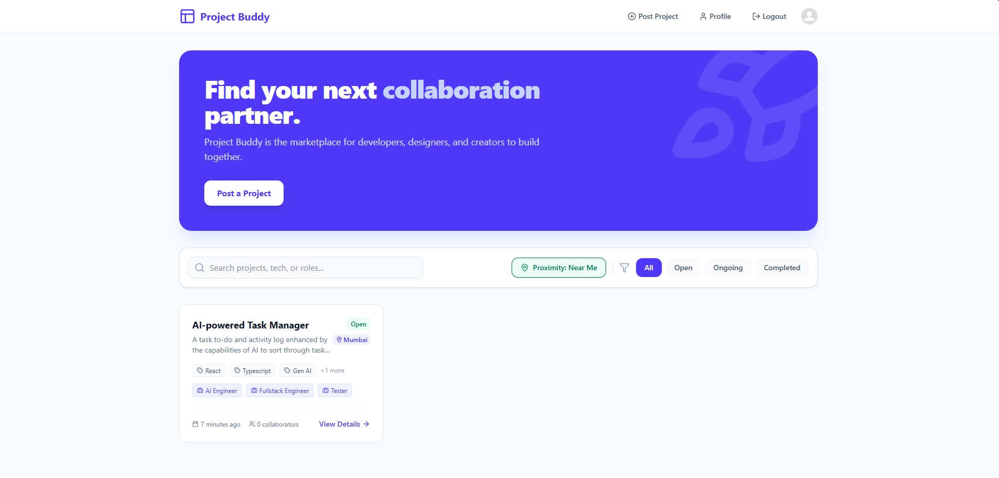
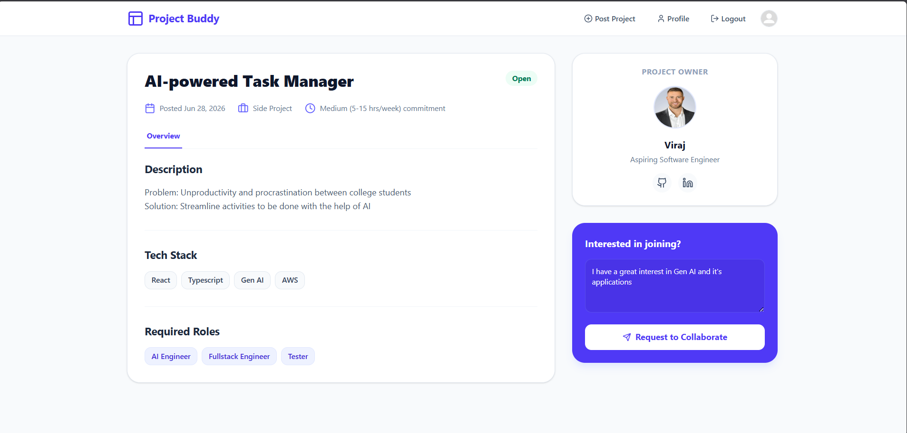
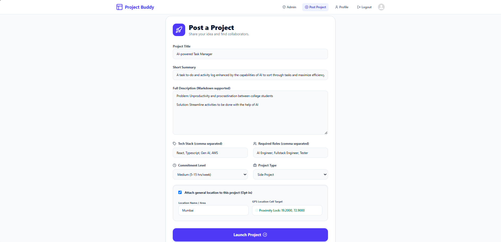
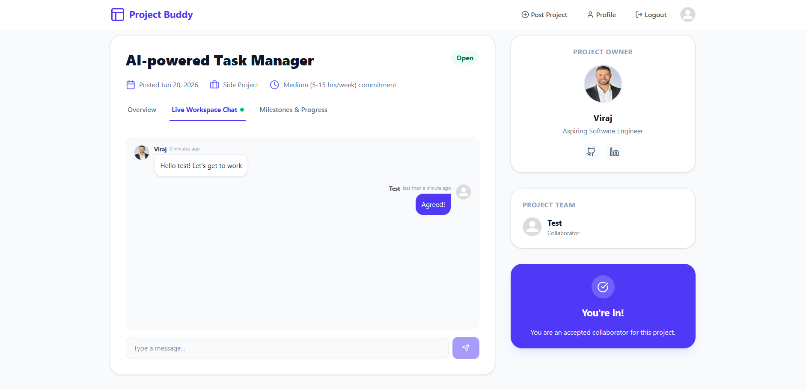
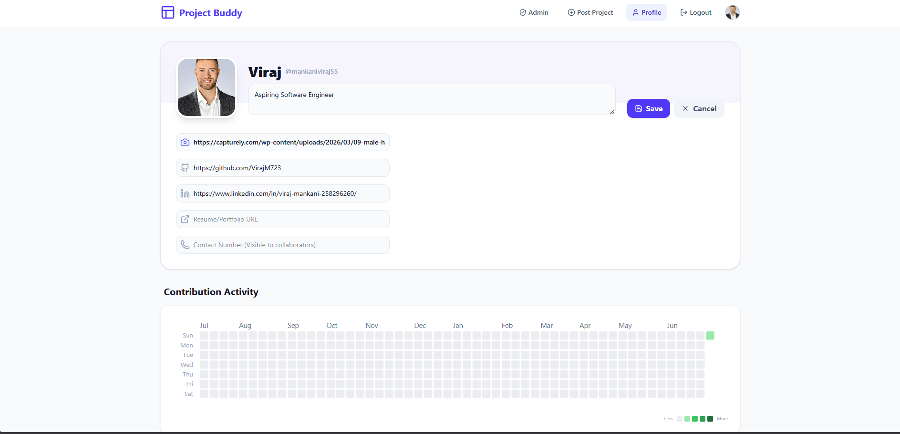
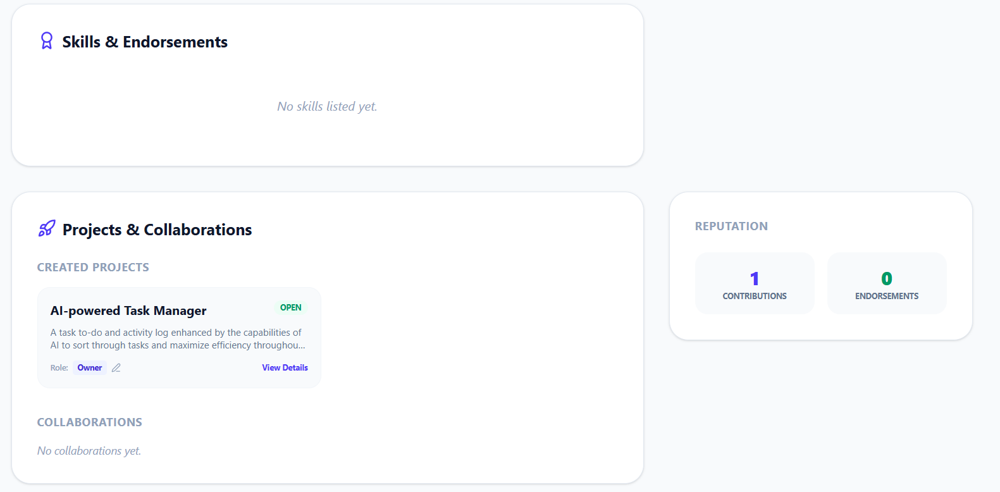

## Features

### Authentication

Project Buddy uses JWT-based authentication to secure user sessions.

-   Register and log in using email and password
-   Secure password hashing with bcrypt
-   Protected routes using JWT
-   Role-based authorization
-   Default profile picture assigned during registration
-   Upload a custom profile picture at any time

------------------------------------------------------------------------

### Project Management

Create projects and manage collaborators from a single dashboard.

-   Create and edit projects
-   Add descriptions, required skills, tech stack, and commitment level
-   Search projects by title, description, creator, tags, or
    technologies
-   Filter projects based on skills, tech stack, location, and
    commitment
-   Browse projects posted by the community

------------------------------------------------------------------------

### Collaboration System

Users can apply to projects and project owners can manage incoming
applications.

-   Send collaboration requests
-   Accept or reject applicants
-   Manage project members
-   Keep track of team composition

------------------------------------------------------------------------

### Real-Time Project Chat

Each project includes a dedicated chat room powered by native
WebSockets.

-   Instant messaging between collaborators
-   Project-specific conversations
-   Messages are stored in MongoDB for future access
-   Automatically synchronizes conversations across connected users

------------------------------------------------------------------------

### Live Activity Feed

Every project maintains an activity feed that updates in real time.

The feed records important events such as:

-   New collaborators joining
-   Project updates
-   Milestone completion

This allows team members to stay informed without manually checking
project details.

------------------------------------------------------------------------

### Project Milestones

Projects can be divided into milestones to organize development.

Users can:

-   Create milestones
-   Assign milestones to collaborators
-   Mark milestones as completed
-   Track overall project progress
-   View milestone history through activity logs

------------------------------------------------------------------------

### Contribution Tracking

Project Buddy includes a GitHub-style contribution heatmap built using
D3.js.

The heatmap provides a visual overview of user activity by tracking:

-   Daily contributions
-   Project participation
-   Development consistency

------------------------------------------------------------------------

### User Profiles

Every user has a public profile showcasing their work and activity.

Profiles include:

-   Bio
-   Technical skills
-   Projects
-   Contribution heatmap
-   Activity history
-   External links
-   Profile picture

New accounts automatically receive a default profile image until one is uploaded via URL.

------------------------------------------------------------------------

### Skill Endorsements

Users can endorse the technical skills of other developers.

These endorsements help showcase experience and improve profile
credibility.

------------------------------------------------------------------------

### Location-Based Project Discovery

Projects are indexed using H3 spatial indexing to support location-aware
discovery.

Users can:

-   Filter projects near their location
-   Discover local collaboration opportunities
-   Combine location filters with existing search and filter options

------------------------------------------------------------------------

### Rate Limiting & Spam Prevention

The backend uses `express-rate-limit` to prevent abuse and protect
application resources.

```md
Configured limits:

- Login / Register: 10 attempts per 15 minutes per IP
- Project Creation: Maximum 5 projects per day per user
- Collaboration Requests: Maximum 10 requests per hour per user

These limits help prevent spam, brute-force attacks, and excessive API usage while maintaining a smooth user experience.
```


These limits reduce spam, brute-force attacks, and excessive API usage
while maintaining a smooth user experience.

## Screenshots













## Tech Stack

**Frontend** - React - TypeScript - Vite - Tailwind CSS - Framer
Motion - Axios - D3.js

**Backend** - Node.js - Express.js - MongoDB - Mongoose - JWT - Native
WebSockets - bcrypt - express-rate-limit - H3.js

## Installation

``` bash
git clone https://github.com/VirajM723/ProjectBuddy.git
cd ProjectBuddy
npm install
```

Create a `.env` file.

``` env
MONGODB_URI=
JWT_SECRET=
PORT=
```

Start the development server.

``` bash
npm run dev
```

## API Modules

-   Authentication
-   Users
-   Projects
-   Collaboration Requests
-   Milestones
-   Chat
-   Activity Logs
-   Skill Endorsements

## Future Improvements

-   Real-time notifications
-   Mobile responsive improvements
-   AI teammate recommendations
-   Calendar and deadline management